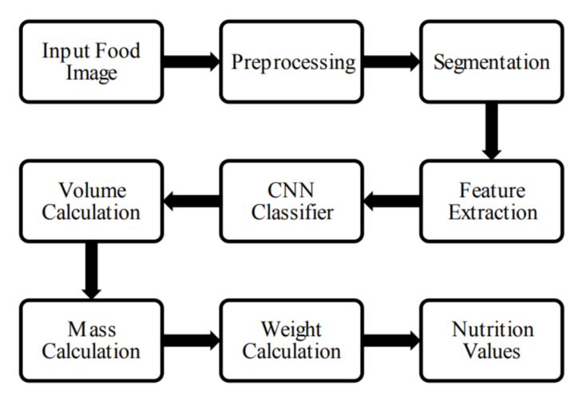

# An AI Based Neutirend Tracking and Analysis
2019 ECM IV A Batch 13

Food recognition deployed on streamlit with inception v3 backend
#### Deployed at [Streamlit](https://ashwinexe-fyp-f00d-recog-inception-bhdsz4.streamlit.app/)

In this project, we propose a novel system based on artificial intelligence (AI) to accurately estimate nutrient intake, by processing image pairs captured in day meal consumption. This allows sequential food segmentation, recognition, and estimation of the consumed food volume, permitting fully automatic estimation of the nutrient intake for each meal. For this development and evaluation of the system, a dedicated new database containing images and nutrient recipes of large variety of meals must be assembled and coupled.

### Learning details

#### Block Diagram

- Training on 16,600 images yielded 90% accuracy on train and 76% accuracy on validation. over 50 epochs!
- This model is saved and used later

### Dataset Details and Classes
Data consists of 1.1GB of 16,600 images of different categories of food.
the categories of food that can be classified are 

    - Bread
    - Dairy Product
    - Dessert
    - Egg
    - Fried Food
    - Meat
    - Noodles-pasta
    - Rice
    - Seafood
    - Soup
    - Vegetable-fruit
    
Dataset is obtained from [kaggle](https://www.kaggle.com/trolukovich/food11-image-dataset)

This project is made by:
- Ashwin Kumar Uppala 19311A1901
- Sanjana Reddy 19311A1908
- Raveena Ganji 19311A1958

